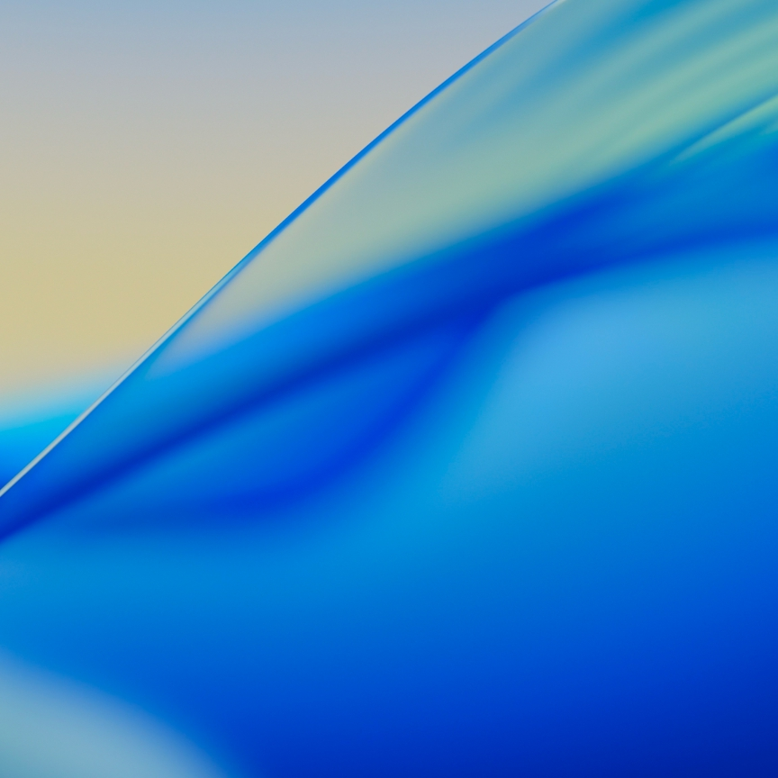

# macOS Dynamic Time Shift

Dynamic background changes with time criteria

## Setting Properties

- macOS version
- Day shift (hour, minute)
- Night shift (hour, minute)
- Position Y (up-down)
- 4-Period Dawn shift (hour, minute)
- 4-Period Day shift (hour, minute)
- 4-Period Dusk shift (hour, minute)
- 4-Period Night shift (hour, minute)

## Available macOS Versions

- 26 Tahoe Beach (4-Period)
- 26 Tahoe
- 15.2 Sequoia
- 14 Sonoma
- 13.0 Ventura
- 12.0 Monterey
- 11.0 Big Sur (Color)
- 11.0 Big Sur
- 10.15 Catalina
- 10.14 Mojave
- 10.13 High Sierra (Day Shift Only)
- 10.12 Sierra (Day Shift Only)

## Default Values

- macOS version: 26
- Day shift (hour): 6
- Day shift (minute): 0
- Night shift (hour): 18
- Night shift (minute): 0
- 4-Period Dawn shift (hour): 6
- 4-Period Dawn shift (minute): 0
- 4-Period Day shift (hour): 7
- 4-Period Day shift (minute): 0
- 4-Period Dusk shift (hour): 17
- 4-Period Dusk shift (minute): 0
- 4-Period Night shift (hour): 18
- 4-Period Night shift (minute): 0
- Position Y (up-down): 50
